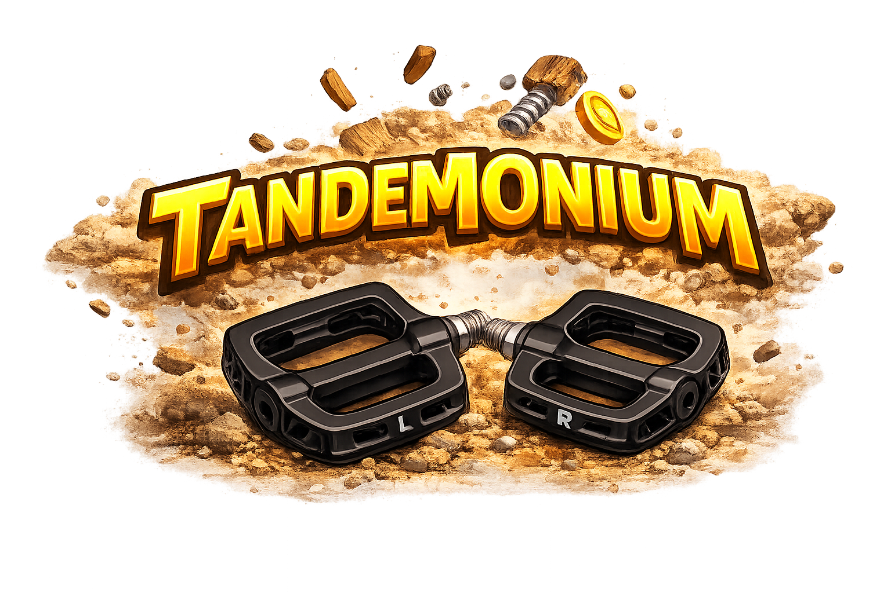
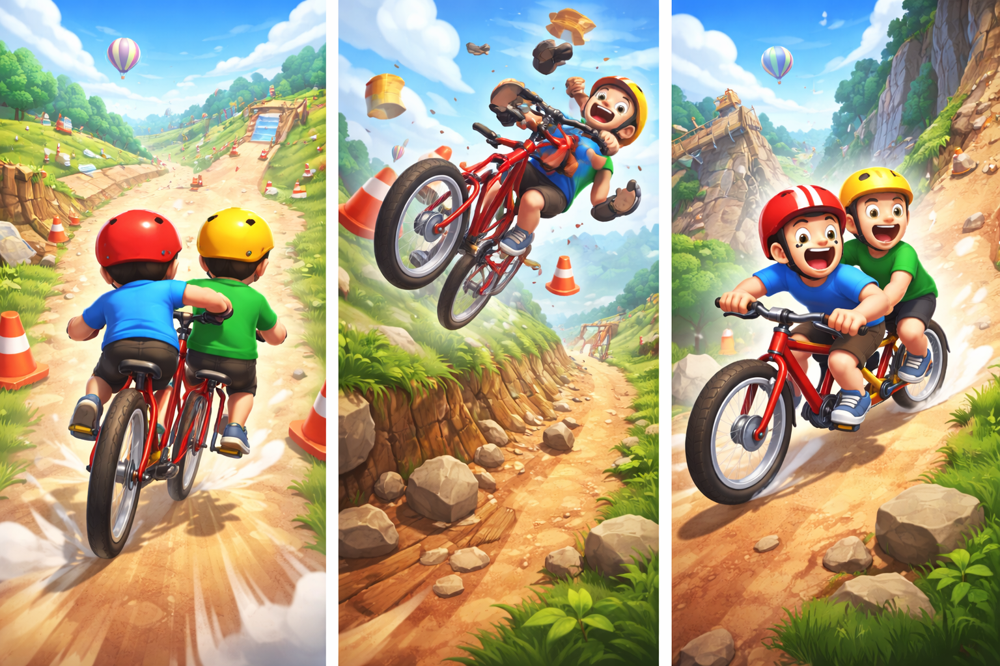

# Tandemonium





A tandem bicycle physics game with real-time P2P multiplayer. Solo or ride together — one screen each, coordinating pedaling and balance over the network.

## Quick Start

Serve the project directory over HTTP (any static server works):

```bash
# Python
python3 -m http.server 8888

# Node
npx serve -l 8888
```

Open `http://localhost:8888` in your browser.

- **Solo**: Click SOLO RIDE — pedal with Up/Down arrows, lean with A/D (or tilt on mobile)
- **Multiplayer**: Click RIDE TOGETHER — one player creates a room, the other joins with the room code

## Multiplayer

### How It Works

Two players connect via [PeerJS](https://peerjs.com/) (WebRTC data channels) for low-latency P2P communication. If WebRTC fails (~20% of connections due to NAT/firewall), an optional Cloudflare Worker relay provides fallback transport.

**Roles:**
- **Captain** (front seat): Runs physics simulation, sends bike state at 20Hz
- **Stoker** (back seat): Sends pedal taps and lean input, receives and interpolates bike state

### Offset Pedaling

Both players use the same Up/Down two-button pedaling as solo mode. The coordination challenge is **offset pedaling** — a real tandem bicycle has a shared crank with pedals 180° apart. When the front rider's right foot goes down, the back rider's left foot goes up.

| Outcome | Condition | Effect |
|---------|-----------|--------|
| Perfect offset | Your foot is opposite partner's last foot | Max power + offset bonus |
| In-phase | Your foot matches partner's last foot | Reduced power, small wobble |
| Wrong foot | You repeated your own last foot | Wobble + power penalty |
| Crank fight | Both press same foot simultaneously | Brake-like, big wobble |

### Network Protocol

All messages are binary (`Uint8Array`) over the PeerJS data channel:

| Message | Byte 0 | Payload | Direction |
|---------|--------|---------|-----------|
| `MSG_PEDAL` (0x01) | 0x01 | byte 1: `0x00`=up, `0x01`=down | Stoker → Captain |
| `MSG_STATE` (0x02) | 0x02 | 37 bytes: position, heading, lean, speed, crank, distance, flags | Captain → Stoker |
| `MSG_EVENT` (0x03) | 0x03 | byte 1: event type (countdown, start, crash, reset) | Captain → Stoker |
| `MSG_HEARTBEAT` (0x04) | 0x04 | byte 1: `0x00`=ping, `0x01`=pong | Both |
| `MSG_LEAN` (0x05) | 0x05 | 4 bytes: float32 lean value | Stoker → Captain |

### PeerJS Setup

The game uses the **free PeerJS cloud signaling server** (`0.peerjs.com`) by default — no configuration needed. PeerJS handles:

1. **Signaling**: Exchanging WebRTC connection offers/answers via the PeerJS broker
2. **ICE/STUN**: Using Google's public STUN server (`stun:stun.l.google.com:19302`) for NAT traversal
3. **Data channel**: Binary unreliable data channel for low-latency game state

The room code (e.g., `TNDM-A3X7`) is used directly as the PeerJS peer ID. The captain registers with this ID; the stoker connects to it.

**To self-host the PeerJS signaling server** (optional, for reliability):

```bash
npm install peer
npx peerjs --port 9000
```

Then update the `new Peer()` calls in `main.js`:

```js
this.peer = new Peer(this.roomCode, {
    host: 'your-server.com',
    port: 9000,
    path: '/',
    config: {
        iceServers: [{ urls: 'stun:stun.l.google.com:19302' }]
    }
});
```

## Cloudflare Relay (Optional Fallback)

When WebRTC P2P fails (corporate firewalls, symmetric NAT), the game can fall back to a Cloudflare Worker WebSocket relay. This is **optional** — P2P works for most connections.

### Architecture

```
Captain ←→ Cloudflare Worker (Durable Object) ←→ Stoker
              WebSocket relay by room code
```

The relay is a Cloudflare Worker using **Durable Objects** — each room code maps to a `TandemRoom` instance that holds two WebSocket connections and relays binary messages between them.

### Deploying the Relay

Prerequisites:
- [Cloudflare account](https://dash.cloudflare.com/sign-up) (free tier works)
- [Wrangler CLI](https://developers.cloudflare.com/workers/wrangler/install-and-update/)

```bash
# Install wrangler
npm install -g wrangler

# Login to Cloudflare
wrangler login

# Deploy from the worker/ directory
cd worker
wrangler deploy
```

This deploys `relay.js` as a Worker with a Durable Object binding. Wrangler outputs the Worker URL (e.g., `https://tandemonium-relay.<your-subdomain>.workers.dev`).

### Connecting the Game to the Relay

Set the `_fallbackUrl` property on `NetworkManager` in `main.js`:

```js
this.net = new NetworkManager();
this.net._fallbackUrl = 'wss://tandemonium-relay.<your-subdomain>.workers.dev';
```

The game will attempt P2P first. If the PeerJS connection doesn't establish within 10 seconds, it automatically falls back to the relay WebSocket.

### Worker Configuration

`worker/wrangler.toml`:

```toml
name = "tandemonium-relay"
main = "relay.js"
compatibility_date = "2024-01-01"

[durable_objects]
bindings = [
    { name = "TANDEM_ROOM", class_name = "TandemRoom" }
]

[[migrations]]
tag = "v1"
new_sqlite_classes = ["TandemRoom"]
```

### Cloudflare Costs

The free tier includes:
- **Workers**: 100,000 requests/day
- **Durable Objects**: 1 million requests/month, 1 GB stored (relay uses no storage)

This is more than enough for casual use. Each multiplayer session uses ~20 WebSocket messages/second per player.

## Testing

Multiplayer demo and test scripts are in `test_multiplayer/`. They use [Puppeteer](https://pptr.dev/) to automate two browser windows.

```bash
# Install dependencies
npm install

# Start a local server (in another terminal)
python3 -m http.server 8888

# Run the interactive demo (opens two browser windows)
node test_multiplayer/demo-multiplayer.js

# Run the automated test
node test_multiplayer/test-multiplayer.js
```

The demo opens two Chrome windows in mobile device emulation (landscape) with DevTools, creates a room, connects, and demonstrates offset pedaling with speed building.

## Physics Parameters

Tunable balance constants live in `BALANCE_DEFAULTS` in [`js/config.js`](js/config.js) — the single source of truth shared by the game and the test harness ([`test/input.html`](test/input.html)). The test page generates tuning sliders from a `SLIDER_CONFIG` array whose defaults should match.

### Input Processing

| Parameter | Default | Formula | Description |
|-----------|---------|---------|-------------|
| `lowPassK` | `0.3` | `gx += (raw - gx) * k` per event | Accelerometer smoothing (0 = frozen, 1 = raw) |
| `deadzone` | `2°` | `if (abs(relative) < deadzone) relative = 0` | Tilt under this angle is ignored |
| `sensitivity` | `40°` | `motionLean = clamp(relative / sensitivity, -1, 1)` | Degrees past dead zone for full lean (±1) |

### Balance Forces

All forces accumulate into `leanVelocity` each frame: `leanVel += (sum of forces) * dt; lean += leanVel * dt`

| Parameter | Default | Formula | Description |
|-----------|---------|---------|-------------|
| `leanForce` | `12` | `leanInput * leanForce` | Player tilt input force. Higher = snappier steering response |
| `gravityForce` | `2.5` | `sin(lean) * gravityForce` | Toppling force that pulls toward a fall. Lower = wider safe lean range |
| `damping` | `4.0` | `-leanVelocity * damping` | Resists lean velocity changes. Higher = more controlled, less runaway |
| gyro | — | `-lean * min(speed * 0.8, 6.0)` | Speed-dependent self-righting force (not tunable) |
| pedalWobble | — | `wobble * (random() - 0.5) * 2` | Random wobble on wrong-foot pedal |
| lowSpeedWobble | — | `max(0, 1 - speed*0.3) * (sin(t*2.7)*0.3 + sin(t*4.3)*0.15)` | Sine-wave wobble that fades with speed |
| pedalLeanKick | — | `(random() - 0.5) * 0.2` | Random lean impulse per pedal stroke |
| dangerWobble | — | ramps from 55–100% of crash threshold | Progressive shake as lean approaches crash |
| grassWobble | — | scales with off-road distance and speed | Rough terrain wobble when off the dirt path |

### Steering

| Parameter | Default | Formula | Description |
|-----------|---------|---------|-------------|
| `turnRate` | `0.50` | `heading += -lean * speed * turnRate * dt` | How much lean angle steers the bike. Higher = tighter turns without needing extreme lean |

### Fall & Recovery

| Parameter | Value | Formula | Description |
|-----------|-------|---------|-------------|
| crash threshold | `1.35 rad` (77°) | `if (abs(lean) > 1.35) → crash` | Lean angle that triggers a crash |
| fall timer | `2.0 s` | seconds before auto-reset | Recovery time after crash |
| safety clamp | `±1.0 rad` (57°) | `lean = clamp(lean, -1.0, 1.0)` | Max lean in safety mode (can't crash) |

### Speed

| Parameter | Value | Formula | Description |
|-----------|-------|---------|-------------|
| friction | `0.15–0.6` | ramped: `frictionMin + (base - min) * min(1, speed/4)` | Low friction at startup, full friction above ~14 km/h |
| center-strip bonus | `0.3` | `speed *= (1 + 0.3 * (1 - dist/0.5) * dt)` within 0.5m of center | Compacted dirt in the middle of the road is faster |
| edge drag | `0.8` | `speed *= (1 - edgeFrac * 0.8 * dt)` from 0.5–2.5m off center | Drifting toward road edges slows you |
| grass drag | `1.5` | `speed *= (1 - intensity * 1.5 * dt)` beyond 2.5m off center | Off-road surface drag, ramps over 3 units |
| maxSpeed | `16` | `speed = clamp(speed, 0, 16)` | Speed cap (m/s) |
| brakeRate | `2.5` | `speed *= (1 - 2.5 * dt)` | Brake decay rate per second |
| brakeStop | `0.05` | `if (speed < 0.05) speed = 0` | Speed snaps to zero below this |
